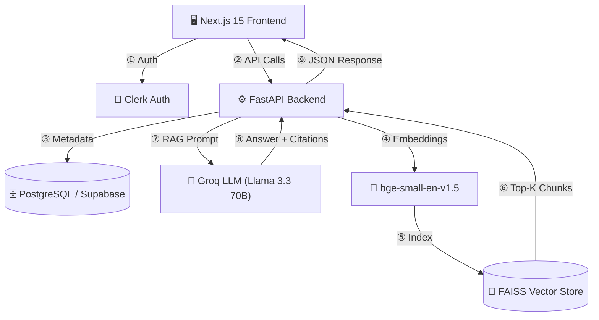

<div align="center">

# ⚖️ Bangladesh AI Legal Assistant

### *An intelligent RAG-powered legal companion for Bangladeshi law*

[](https://nextjs.org/)
[](https://fastapi.tiangolo.com/)
[](https://python.org/)
[](https://typescriptlang.org/)
[](https://supabase.com/)
[](LICENSE)

> 🎓 **Capstone Project** — A production-grade AI application that answers questions on Bangladeshi laws, the Constitution, and government statutes using a full **Retrieval-Augmented Generation (RAG)** pipeline.

[📖 API Docs](http://localhost:8000/docs) · [🐛 Report Bug](https://github.com/SABBiR1107/bd-legal-assistant/issues)

</div>

---

## ✨ Features

| Feature | Description |
|---------|-------------|
| 🤖 **AI Legal Chatbot** | Ask questions in English about Bangladesh Constitution, Labour Act, Penal Code, and more |
| 📄 **PDF Ingestion** | Upload government gazettes, acts, or ordinances — auto-chunked & indexed |
| 🔍 **RAG Pipeline** | Retrieves the most relevant legal passages using FAISS vector similarity search |
| 📚 **Citation-Based Answers** | Every answer cites the exact document name and page number |
| 🔐 **Secure Auth** | Full authentication with Clerk (Email + Google OAuth) |
| 📊 **Admin Dashboard** | Upload, manage, and monitor all ingested legal documents |
| 🌐 **REST API** | Well-documented FastAPI backend with Swagger UI |

---

## 🏗️ System Architecture



---

## 🛠️ Tech Stack

### Frontend
| Technology | Version | Purpose |
|-----------|---------|---------|
| [Next.js](https://nextjs.org/) | 15.3.5 | React framework with App Router |
| [TypeScript](https://typescriptlang.org/) | 5.x | Type-safe development |
| [Clerk](https://clerk.com/) | latest | Authentication & user management |
| [Lucide React](https://lucide.dev/) | latest | Icon library |

### Backend
| Technology | Version | Purpose |
|-----------|---------|---------|
| [FastAPI](https://fastapi.tiangolo.com/) | 0.111.0 | High-performance REST API |
| [LangChain](https://langchain.com/) | 0.2.5 | LLM orchestration framework |
| [LangChain-Groq](https://python.langchain.com/) | 0.1.6 | Groq LLM integration |
| [FAISS](https://github.com/facebookresearch/faiss) | 1.8.0 | Local vector similarity search |
| [Sentence Transformers](https://sbert.net/) | 3.0.1 | `bge-small-en-v1.5` embeddings |
| [PyPDF2](https://pypdf2.readthedocs.io/) | 3.0.1 | PDF text extraction |
| [SQLAlchemy](https://sqlalchemy.org/) | 2.0.31 | ORM for PostgreSQL |
| [Supabase](https://supabase.com/) | — | Managed PostgreSQL database |

### AI / ML Models
| Model | Provider | Role |
|-------|----------|------|
| `llama-3.3-70b-versatile` | Groq (ultra-fast inference) | Legal Q&A generation |
| `bge-small-en-v1.5` | BAAI / HuggingFace | Text embedding (384-dim) |

---

## 📂 Project Structure

```
bd-legal-assistant/
├── 📁 backend/
│   ├── 📁 app/
│   │   ├── 📁 api/endpoints/
│   │   │   └── legal_endpoints.py     # Upload, List, Delete, Chat routes
│   │   ├── 📁 models/
│   │   │   └── legal_models.py        # SQLAlchemy ORM (DocumentModel)
│   │   ├── 📁 schemas/
│   │   │   └── legal_schemas.py       # Pydantic request/response schemas
│   │   ├── 📁 services/
│   │   │   └── ai_pipeline.py         # RAG ingestion + FAISS + LLM pipeline
│   │   ├── config.py                  # Settings via pydantic-settings
│   │   ├── database.py                # SQLAlchemy engine & session
│   │   └── main.py                    # FastAPI app, CORS, router mount
│   ├── 📁 data/faiss/                 # Persisted FAISS index (auto-generated)
│   ├── 📁 tests/                      # Pytest unit tests
│   ├── Dockerfile
│   ├── requirements.txt
│   └── .env.example
│
├── 📁 frontend/
│   ├── 📁 src/
│   │   ├── 📁 app/
│   │   │   ├── page.tsx               # Main chatbot UI
│   │   │   ├── layout.tsx             # Root layout with ClerkProvider
│   │   │   ├── globals.css
│   │   │   ├── 📁 admin/page.tsx      # Admin dashboard
│   │   │   ├── 📁 sign-in/            # Custom Clerk sign-in page
│   │   │   └── 📁 sign-up/            # Custom Clerk sign-up page
│   │   ├── 📁 lib/utils.ts
│   │   └── middleware.ts              # Clerk route protection
│   ├── package.json
│   ├── tsconfig.json
│   ├── Dockerfile
│   └── .env.example
│
├── docker-compose.yml
├── render.yaml
└── README.md
```

---

## 🔌 API Reference

Base URL: `http://localhost:8000`  
Interactive Docs: [`http://localhost:8000/docs`](http://localhost:8000/docs)

| Method | Endpoint | Description | Body |
|--------|----------|-------------|------|
| `GET` | `/` | Health check | — |
| `POST` | `/api/upload` | Upload PDF → chunk → embed → FAISS index | `multipart/form-data` |
| `GET` | `/api/documents` | List all ingested documents | — |
| `DELETE` | `/api/documents/{id}` | Remove document record | — |
| `POST` | `/api/chat` | Legal Q&A via RAG pipeline | `{"message": "...", "history": []}` |

**Chat Response Example:**
```json
{
  "answer": "Under Article 27 of the Bangladesh Constitution, all citizens are equal before the law...",
  "citations": [
    {
      "source": "Bangladesh_Constitution.pdf",
      "page": 12,
      "content": "Article 27: All citizens are equal before law..."
    }
  ]
}
```

---

## 🚀 Local Development Setup

### Prerequisites
- **Node.js** v18+ & npm
- **Python** 3.10+
- **Git**
- [Clerk](https://clerk.com/) account — for auth keys
- [Groq](https://console.groq.com/) account — for LLM API key
- [Supabase](https://supabase.com/) project — for PostgreSQL

---

### 1️⃣ Clone the Repository

```bash
git clone https://github.com/SABBiR1107/bd-legal-assistant.git
cd bd-legal-assistant
```

---

### 2️⃣ Backend Setup

```bash
cd backend

# Create and activate virtual environment
python -m venv venv
venv\Scripts\activate          # Windows
# source venv/bin/activate     # macOS/Linux

# Install dependencies
pip install -r requirements.txt

# Configure environment
cp .env.example .env
```

Edit `backend/.env`:
```env
PROJECT_NAME="Bangladesh AI Legal Assistant API"
DEBUG=True
DATABASE_URL="postgresql://postgres.<ref>:<password>@aws-0-<region>.pooler.supabase.com:5432/postgres?sslmode=require"
GROQ_API_KEY="gsk_..."
FAISS_INDEX_PATH="data/faiss"
```

```bash
uvicorn app.main:app --reload --port 8000
```
✅ Backend: `http://localhost:8000` | 📖 Swagger: `http://localhost:8000/docs`

---

### 3️⃣ Frontend Setup

```bash
cd frontend
npm install
cp .env.example .env.local
```

Edit `frontend/.env.local`:
```env
NEXT_PUBLIC_CLERK_PUBLISHABLE_KEY=pk_test_...
CLERK_SECRET_KEY=sk_test_...
NEXT_PUBLIC_API_URL=http://localhost:8000
```

```bash
npm run dev
```
✅ Frontend: `http://localhost:3000`

---

### 4️⃣ Docker Compose (Full Stack)

```bash
docker-compose up --build
```

---

## 📖 How to Use

**Step 1 — Sign Up / Log In**  
Go to `http://localhost:3000` and create an account using Email or Google.

**Step 2 — Upload Legal Documents (Admin)**  
Navigate to `/admin` → Upload any Bangladesh government PDF.  
The system automatically:
- Extracts text page by page
- Splits into 800-character chunks (150-char overlap)
- Generates 384-dim embeddings using `bge-small-en-v1.5`
- Stores vectors in local FAISS index

**Step 3 — Ask Legal Questions**  
Example queries:
```
"What are the fundamental rights in the Bangladesh Constitution?"
"What is the maximum working hours under the Labour Act 2006?"
"What are the penalties for cybercrime under the Digital Security Act?"
```

---

## 🧪 Running Tests

```bash
cd backend
pytest tests/ -v
```

---

## 🌍 Deployment

This project includes `render.yaml` for deployment on [Render.com](https://render.com/).

For production:
1. Set all environment variables in your hosting dashboard
2. Use a persistent volume for the FAISS index (`data/faiss/`)
3. Configure CORS origins to your production domain

---

## 🤝 Contributing

1. Fork the repository
2. Create a feature branch: `git checkout -b feature/amazing-feature`
3. Commit your changes: `git commit -m 'Add amazing feature'`
4. Push to branch: `git push origin feature/amazing-feature`
5. Open a Pull Request

---

## 📜 License

This project is licensed under the **MIT License**.

---

## 👤 Author

**Sabbir Hossain**  
🎓 Capstone Project — Bangladesh AI Legal Assistant  
🔗 GitHub: [@SABBiR1107](https://github.com/SABBiR1107)

---

<div align="center">

Made with ❤️ for access to legal knowledge in Bangladesh

⭐ **Star this repo** if you found it helpful!

</div>
